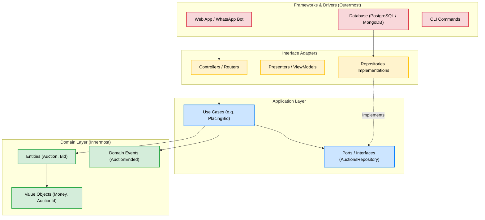
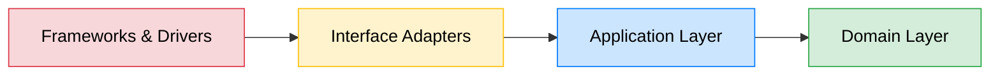
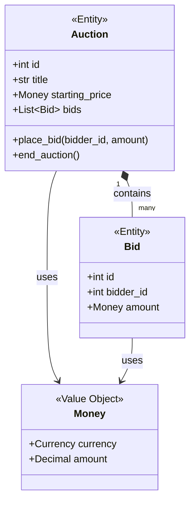

# Learning DDD, TDD & Clean Architecture — Chapter 1: The Big Picture

> **Your two codebases:**
> - **Primary** (we'll study): [`clean-architecture`](file:///home/kgotso-koete/Documents/Projects/Work/Training/clean-architecture) — textbook Clean Architecture in Python/Flask
> - **Sister repo** (we'll steal from later): [`python-ddd`](file:///home/kgotso-koete/Documents/Projects/Work/Training/python-ddd) — DDD building blocks + modern tooling

> **Your books:**
> - 📘 [Architecture Patterns with Python (Cosmic Python)](https://www.cosmicpython.com/book/preface) — Harry Percival & Bob Gregory
> - 📗 [Test-Driven Development with Python (Obey the Testing Goat)](https://www.obeythetestinggoat.com/pages/book.html) — Harry Percival

---

## 🗺️ The Learning Roadmap

We'll cover these fundamentals one at a time. **This is Chapter 1 — we start here.**

| # | Concept | Status |
|---|---------|--------|
| **1** | **The Big Picture: What is Clean Architecture?** | 📍 You are here |
| **2** | **Entities & Value Objects** (the core of DDD) | 📍 You are here |
| 3 | The Repository Pattern (Ports & Adapters intro) | Coming next |
| 4 | Use Cases (Application Services) | Coming next |
| 5 | The Output Boundary & Presenter Pattern | Coming next |
| 6 | Domain Events & the Event Bus | Coming next |
| 7 | Dependency Injection (wiring it all together) | Coming next |
| 8 | Process Managers (Sagas) — cross-module workflows | Coming next |
| 9 | Test-Driven Development in practice | Coming next |
| 10 | Bringing it all together + future improvements | Coming next |

---

## Part 1: What is Clean Architecture?

### The One-Sentence Version
> **Clean Architecture is a set of rules that keep your business logic independent of frameworks, databases, and delivery mechanisms (Web, API, CLI, WhatsApp).**

### Why Should You Care?

Imagine you build a truck-hiring system. Today it's a web app. Tomorrow your client says:
- *"We also need a WhatsApp bot"*
- *"We're switching from PostgreSQL to MongoDB"*
- *"We need a CLI for admin operations"*

In a **typical Flask app**, your business logic is tangled inside route handlers, SQLAlchemy models, and template rendering. Changing any of those things means rewriting business logic.

In **Clean Architecture**, the business logic is in the center, untouched. You just plug in new "adapters" for each delivery mechanism.

### 📚 Book Reference
> **Cosmic Python, Chapter 1**: *"Domain Modeling"* — introduces why separating domain logic from infrastructure matters.
> Read: https://www.cosmicpython.com/book/chapter_01_domain_model.html

### 🔗 External Resources
- [Uncle Bob's original Clean Architecture article](https://blog.cleancoder.com/uncle-bob/2012/08/13/the-clean-architecture.html) (5 min read — the foundational blog post)
- [Clean Architecture diagram explained](https://herbertograca.com/2017/11/16/explicit-architecture-01-ddd-hexagonal-onion-clean-cqrs-how-i-put-it-all-together/) (excellent visual walkthrough)

---

### The Concentric Circles

Clean Architecture is often drawn as concentric circles. Here's how the **`clean-architecture` repo** maps to them:

```text
┌─────────────────────────────────────────────────────────────┐
│                    FRAMEWORKS & DRIVERS                      │
│  (the outermost ring — the "plumbing")                      │
│                                                             │
│  web_app/         → Flask routes, templates, blueprints     │
│  main/            → Bootstrap, DI container, DB engine      │
│  db_infrastructure/ → SQLAlchemy metadata                    │
│                                                             │
│  ┌─────────────────────────────────────────────────────┐    │
│  │              INTERFACE ADAPTERS                      │    │
│  │  (translates between core and outside world)        │    │
│  │                                                     │    │
│  │  auctions_infrastructure/  → SqlAlchemyAuctionsRepo │    │
│  │  shipping_infrastructure/  → SQL shipping repo      │    │
│  │  web_app/presenters.py     → View model formatters  │    │
│  │                                                     │    │
│  │  ┌─────────────────────────────────────────────┐    │    │
│  │  │          APPLICATION LAYER                   │    │    │
│  │  │  (orchestrates domain objects)               │    │    │
│  │  │                                              │    │    │
│  │  │  auctions/application/use_cases/             │    │    │
│  │  │  auctions/application/repositories/ (iface)  │    │    │
│  │  │  auctions/application/queries/ (iface)       │    │    │
│  │  │                                              │    │    │
│  │  │  ┌─────────────────────────────────────┐     │    │    │
│  │  │  │        DOMAIN LAYER (the core)       │     │    │    │
│  │  │  │  (pure business rules, no imports    │     │    │    │
│  │  │  │   from outer layers)                 │     │    │    │
│  │  │  │                                      │     │    │    │
│  │  │  │  auctions/domain/entities/           │     │    │    │
│  │  │  │  auctions/domain/events.py           │     │    │    │
│  │  │  │  auctions/domain/value_objects.py    │     │    │    │
│  │  │  │  auctions/domain/exceptions.py       │     │    │    │
│  │  │  │  foundation/value_objects/            │     │    │    │
│  │  │  │  foundation/events.py (base Event)   │     │    │    │
│  │  │  └─────────────────────────────────────┘     │    │    │
│  │  └─────────────────────────────────────────────┘    │    │
│  └─────────────────────────────────────────────────────┘    │
└─────────────────────────────────────────────────────────────┘
```

#### Visualizing the Layers

Here is the same concept illustrated visually. Notice how the flow of control moves inward:



### ⚡ The Dependency Rule (The Most Important Rule)

> **Source code dependencies must point INWARD. Nothing in an inner circle can know anything about an outer circle.**



This means:
- ✅ `auctions/domain/entities/auction.py` can import from `foundation/`
- ✅ `auctions/application/use_cases/` can import from `auctions/domain/`
- ✅ `auctions_infrastructure/` can import from `auctions/application/`
- ✅ `web_app/` can import from `auctions/`
- ❌ `auctions/domain/` NEVER imports from `auctions_infrastructure/` (no SQLAlchemy!)
- ❌ `auctions/domain/` NEVER imports from `web_app/` (no Flask!)

### See It In The Code

Open [auction.py](file:///home/kgotso-koete/Documents/Projects/Work/Training/clean-architecture/auctioning_platform/auctions/auctions/domain/entities/auction.py) and look at the imports:

```python
# auction.py — DOMAIN layer
from foundation.events import EventMixin          # ✅ foundation is also domain-level
from foundation.value_objects import Money         # ✅ domain-level value object

from auctions.domain.entities.bid import Bid      # ✅ same domain
from auctions.domain.events import AuctionBegan    # ✅ same domain
from auctions.domain.exceptions import ...         # ✅ same domain
from auctions.domain.value_objects import ...      # ✅ same domain
```

Notice: **zero** imports of Flask, SQLAlchemy, Redis, or any infrastructure. The `Auction` entity is pure Python. It could run in a test, a CLI, or on Mars.

Now compare with [auctions.py in infrastructure](file:///home/kgotso-koete/Documents/Projects/Work/Training/clean-architecture/auctioning_platform/auctions_infrastructure/auctions_infrastructure/repositories/auctions.py):

```python
# SqlAlchemyAuctionsRepo — INFRASTRUCTURE layer
from sqlalchemy.engine import Connection, RowProxy     # outer-ring import (OK here!)
from auctions.application.repositories import AuctionsRepository  # points INWARD ✅
from auctions.domain.entities import Auction, Bid      # points INWARD ✅
```

**Infrastructure imports from Domain. Never the reverse.** This is the Dependency Rule in action.

---

## Part 2: Entities & Value Objects

These are the **innermost** building blocks of DDD. Let's understand them one by one.

#### Visualizing the Relationships



### 2A. What is an Entity?

> **An Entity is an object defined by its identity, not its attributes. Two entities with the same data are NOT the same if they have different IDs.**

**Real-world analogy:** Two people named "Kgotso Koete" born on the same day are still different people. Their identity (ID number) makes them unique — not their name or birthday.

#### 📚 Book Reference
> **Cosmic Python, Chapter 1**: *"What Is a Domain Model?"* — Section on Entities
> Read: https://www.cosmicpython.com/book/chapter_01_domain_model.html

#### 🔗 External Resource
> [Martin Fowler on Entities](https://martinfowler.com/bliki/EvansClassification.html) — concise 2-minute explanation

#### 🔍 In Your Codebase: The `Auction` Entity

Open [auction.py](file:///home/kgotso-koete/Documents/Projects/Work/Training/clean-architecture/auctioning_platform/auctions/auctions/domain/entities/auction.py):

```python
class Auction(EventMixin):
    def __init__(
        self, id: AuctionId, title: str, starting_price: Money,
        bids: List[Bid], ends_at: datetime, ended: bool
    ) -> None:
        super().__init__()
        self.id = id              # <-- THIS is what makes it an Entity
        self.title = title
        self.starting_price = starting_price
        self.bids = sorted(bids, key=lambda bid: bid.amount)
        self.ends_at = ends_at
        self._ended = ended
```

**Key observations:**
1. **It has an `id`** — this is what makes it an Entity (not a Value Object)
2. **It has behavior** — `place_bid()`, `withdraw_bids()`, `end_auction()` — it's not just a data container
3. **It enforces business rules** — like *"you can't bid on an ended auction"*:

```python
def place_bid(self, bidder_id: BidderId, amount: Money) -> None:
    if self._should_end:
        raise BidOnEndedAuction  # 👈 Business rule enforcement
```

4. **It records Domain Events** — `self._record_event(WinningBidPlaced(...))` — we'll cover this in Chapter 6
5. **It has NO database code** — no SQLAlchemy, no SQL, no ORM decorators

> [!IMPORTANT]
> **This is the #1 lesson**: Your Entity is pure business logic. It doesn't know HOW it gets stored or displayed. It only knows the business RULES.

#### The `Bid` Entity

Open [bid.py](file:///home/kgotso-koete/Documents/Projects/Work/Training/clean-architecture/auctioning_platform/auctions/auctions/domain/entities/bid.py):

```python
@dataclass(unsafe_hash=True)
class Bid:
    id: Optional[BidId]
    bidder_id: BidderId
    amount: Money
```

This is a simpler entity — it has an `id`, a `bidder_id`, and an `amount`. Notice `id` is `Optional` because new bids don't have a database ID yet (it gets assigned when saved).

---

### 2B. What is a Value Object?

> **A Value Object is defined by its attributes, not its identity. Two Value Objects with the same data ARE the same thing.**

**Real-world analogy:** A R100 note in your left pocket is interchangeable with a R100 note in your right pocket. You don't track individual notes by serial number — the *value* is what matters.

#### 📚 Book Reference
> **Cosmic Python, Chapter 1**: *"Value Objects"* section
> Read: https://www.cosmicpython.com/book/chapter_01_domain_model.html

#### 🔗 External Resource
> [Martin Fowler on Value Objects](https://martinfowler.com/bliki/ValueObject.html) — short, authoritative definition

#### 🔍 In Your Codebase: `Money` and Type Aliases

**Simple Value Objects** — open [value_objects.py](file:///home/kgotso-koete/Documents/Projects/Work/Training/clean-architecture/auctioning_platform/auctions/auctions/domain/value_objects.py):

```python
BidderId = int
BidId = int
AuctionId = int
```

These are the simplest form of Value Objects — type aliases. They communicate intent: when you see `AuctionId`, you know it's not just any integer, it represents an auction's identity.

**Rich Value Object** — `Money` (from the `foundation` package):

The `Money` class is a proper Value Object. It has a currency and an amount. Two `Money(USD, "10.00")` instances are equal and interchangeable.

#### 🔍 Comparison: What `python-ddd` Does Better

The sister repo has explicit base classes in its seedwork. Look at [python-ddd/src/seedwork/domain/](file:///home/kgotso-koete/Documents/Projects/Work/Training/python-ddd/src/seedwork/domain):

```
seedwork/domain/
├── aggregates.py      # AggregateRoot base class
├── entities.py        # Entity base class with ID tracking
├── events.py          # DomainEvent base
├── rules.py           # BusinessRule base (explicit rule objects!)
├── value_objects.py   # ValueObject base with equality by attributes
└── repositories.py    # Generic Repository interface
```

> [!TIP]
> **Future improvement**: As you get comfortable, we'll steal these explicit base classes from `python-ddd` and add them to `clean-architecture`. This makes the DDD building blocks visible and self-documenting.

---

### Entity vs Value Object — Cheat Sheet

| | **Entity** | **Value Object** |
|---|---|---|
| **Identity** | Has unique ID | No ID — defined by attributes |
| **Equality** | Same ID = same thing | Same attributes = same thing |
| **Mutability** | Can change over time | Immutable (frozen) |
| **In this codebase** | `Auction`, `Bid` | `Money`, `AuctionId`, `BidderId` |
| **Example** | Auction #42 gets more bids | $10.00 is always $10.00 |

---

## 🧪 Hands-On Exercise #1

Before we move to Chapter 2, try these to solidify your understanding:

### Exercise 1A: Trace the Dependency Rule
Open these 4 files and verify that imports only point **inward** (toward the center):

1. [auction.py](file:///home/kgotso-koete/Documents/Projects/Work/Training/clean-architecture/auctioning_platform/auctions/auctions/domain/entities/auction.py) (Domain) — should import ONLY from `foundation/` and `auctions/domain/`
2. [placing_bid.py](file:///home/kgotso-koete/Documents/Projects/Work/Training/clean-architecture/auctioning_platform/auctions/auctions/application/use_cases/placing_bid.py) (Application) — should import from `auctions/domain/` and `auctions/application/`
3. [auctions.py (infra)](file:///home/kgotso-koete/Documents/Projects/Work/Training/clean-architecture/auctioning_platform/auctions_infrastructure/auctions_infrastructure/repositories/auctions.py) (Infrastructure) — should import from `auctions/domain/` and `auctions/application/` and `sqlalchemy`
4. [auctions.py (blueprint)](file:///home/kgotso-koete/Documents/Projects/Work/Training/clean-architecture/auctioning_platform/web_app/web_app/blueprints/auctions.py) (Framework) — imports from everything including Flask

**Question to answer**: *Can you find any import that violates the Dependency Rule? (Hint: you shouldn't find any!)*

### Exercise 1B: Identify Entities vs Value Objects
Look at [auction.py](file:///home/kgotso-koete/Documents/Projects/Work/Training/clean-architecture/auctioning_platform/auctions/auctions/domain/entities/auction.py) and answer:
1. What makes `Auction` an Entity and not a Value Object?
2. Why is `Money` a Value Object and not an Entity?
3. If two auctions have the same title, same price, and same bids — are they the same auction? Why or why not?

### Exercise 1C: Read the Book Chapter
Read [Cosmic Python Chapter 1](https://www.cosmicpython.com/book/chapter_01_domain_model.html) and note:
- Where do they use Entities?
- Where do they use Value Objects?
- How does their approach compare to this codebase?

---

## 🗺️ What's Coming Next — Chapter 2: The Repository Pattern

In the next chapter, we'll tackle the **Repository Pattern** — the most important "Port & Adapter" in Clean Architecture. You'll learn:

- What a **Port** is (the abstract interface in the application layer)
- What an **Adapter** is (the concrete implementation in the infrastructure layer)
- Why the `AuctionsRepository` abstract class exists
- How `SqlAlchemyAuctionsRepo` implements it
- How `InMemoryAuctionsRepo` is used for testing
- How this connects to Cosmic Python Chapter 2

> [!NOTE]
> **Tell me when you're ready for Chapter 2**, or if you have questions about anything in Chapter 1. We'll go at your pace — there's no rush. The goal is deep understanding, not speed.

---

## 📁 Quick Reference: File Map

For quick navigation, here's where everything lives:

```text
clean-architecture/auctioning_platform/
│
├── foundation/              # 🟢 DOMAIN: shared building blocks
│   └── foundation/
│       ├── events.py        # Event, EventBus, EventMixin base classes
│       ├── value_objects/   # Money, Currency value objects
│       └── locks.py         # Lock abstraction
│
├── auctions/                # 🟢 DOMAIN + 🔵 APPLICATION
│   └── auctions/
│       ├── domain/
│       │   ├── entities/    # Auction, Bid (Entities)
│       │   ├── events.py    # WinningBidPlaced, AuctionEnded (Domain Events)
│       │   ├── exceptions.py # BidOnEndedAuction, etc.
│       │   └── value_objects.py # AuctionId, BidderId (Value Objects)
│       ├── application/
│       │   ├── use_cases/   # PlacingBid, BeginningAuction (Use Cases)
│       │   ├── repositories/ # AuctionsRepository (PORT - interface)
│       │   └── queries/     # GetActiveAuctions (PORT - interface)
│       └── tests/           # Unit tests with in-memory repos
│
├── auctions_infrastructure/ # 🟠 INFRASTRUCTURE (ADAPTERS)
│   └── auctions_infrastructure/
│       ├── repositories/    # SqlAlchemyAuctionsRepo (ADAPTER)
│       ├── queries/         # SqlGetActiveAuctions (ADAPTER)
│       └── models.py        # SQLAlchemy table definitions
│
├── payments/                # 🟢 Another bounded context
├── shipping/                # 🟢 Another bounded context
├── processes/               # 🔵 Cross-module orchestration (Sagas)
├── customer_relationship/   # 🟢 Another bounded context
│
├── web_app/                 # 🔴 FRAMEWORK (Flask delivery mechanism)
│   └── web_app/
│       ├── app.py           # Flask app factory
│       ├── blueprints/      # Route handlers
│       ├── presenters.py    # View model formatters
│       └── templates/       # Jinja2 HTML templates
│
└── main/                    # 🔴 FRAMEWORK (Bootstrap & DI)
    └── main/
        ├── __init__.py      # bootstrap_app() — wires everything
        └── modules.py       # DI container configuration
```
